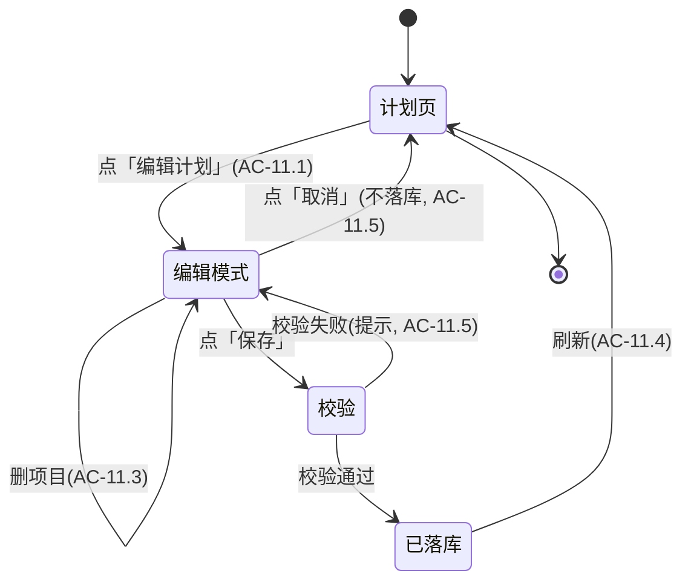

# 设计规格 — 需求 11 当前计划逐条编辑

> 角色：需求/设计负责人 ｜ 迭代：v2.1 ｜ 关联 AC：AC-11.1 ~ AC-11.7
> 必读：`requirements.md` §需求11、`PlanModels.swift`（`PlanItem`/`TrainingPlan`）、`PlanRepository.swift`、`PlanViewModel.swift`、`TrainingContentData.swift`
> 决策状态：open-questions Q6 已确认 → **仅实现全量保存**（`updatePlanItems`），不提供单条粒度 Repository 方法。

## 0. AC 映射一览
| AC | 设计落点 |
|----|----------|
| AC-11.1 | PlanView 顶部 Menu 新增「编辑计划」入口（≤2 次点击进入编辑模式）|
| AC-11.2 | 逐条改：替换方法 / 改单次时长 / 改所在日期 |
| AC-11.3 | 增删某天项目（新增从方法池选；删除即移除）|
| AC-11.4 | 保存写入 Core Data（后台上下文+合并）+ 刷新进度/日历/今日 + `updateProgress()` |
| AC-11.5 | 取消不落库；保存校验：时长>0、日期∈[startDate,endDate] |
| AC-11.6 | 复用 `PlanRepository`/`PlanItem`；保留「智能调整」入口 |
| AC-11.7 | 编辑界面 Dynamic Type / ≥44pt / VoiceOver |

## 1. 编辑草稿状态机



- **草稿 = 当前 `TrainingPlan` 的内存可变副本**（`PlanEditDraft` 持有 `items` 可变数组）。进入编辑即深拷贝 `currentPlan`，全程不写库；「取消」直接丢弃副本（AC-11.5）。
- **保留「智能调整」**：编辑模式与「智能调整」入口互斥/并存均可，二者均最终落到 `updatePlanItems`；不改动 `adjustPlanIfNeeded`（AC-11.6）。

## 2. 数据模型（沿用，不新增实体）
- **复用 `PlanItem`**：`id / date / methodId / methodName / duration / isCompleted / completedAt`。编辑仅修改 `methodId/methodName/duration/date` 四个可变维度；`isCompleted/completedAt` 保持（已完成的项编辑后可保留完成态）。
- **复用 `TrainingPlan`**：`items` 替换为草稿 `items` 后整体保存；`updateProgress()` 依据 `items` 重算（AC-11.4）。
- **方法来源**：`TrainingContentData.allTrainingMethods()` 提供方法池；替换/新增时取 `method.id` 与 `method.name`。

### 2.1 编辑态载体（建议新增轻量结构体，不落库）
```swift
struct PlanEditDraft {
    let planId: UUID
    let startDate: Date
    let endDate: Date
    var items: [PlanItem]          // 可变副本
}
```

## 3. `PlanRepository` 接口契约（数据层）

主保存路径复用既有 `updatePlanItems(planId:items:)`（全量替换 items 并重算进度）。**Q6 已确认：v2.1 仅实现全量保存，不提供单条粒度方法**；编辑态的增/删/改均在内存 `PlanEditDraft.items` 上完成，保存时一次性整体落库。

```swift
// 既有（直接复用，勿改）
func updatePlanItems(planId: UUID, items: [PlanItem])      // 全量替换 + updateProgress
```

- 写操作沿用 `dataController.performBackgroundTask` + 主上下文合并策略（呼应 AC-NF.8），与 `saveTrainingPlan` 既有一致。
- 进度一致性：保存后 `updatePlanItems` 内部已调用 `updateProgress()`（重算 `CDTrainingPlan.progress`）。

## 4. `PlanViewModel` 契约（前端驱动）

```swift
@Published var showPlanEditor: Bool = false
@Published var editingDraft: PlanEditDraft? = nil

/// 进入编辑模式：深拷贝当前计划为草稿（AC-11.1）
func beginPlanEditing()
/// 替换某项的训练方法（AC-11.2）
func editItemMethod(_ itemId: UUID, method: TrainingMethod)
/// 修改某项单次时长（单位秒；保存校验 >0，AC-11.2）
func editItemDuration(_ itemId: UUID, duration: TimeInterval)
/// 修改某项所在日期（校验落在 [startDate,endDate]，AC-11.2）
func editItemDate(_ itemId: UUID, date: Date)
/// 新增项目（默认未完成；duration 取自所选方法 defaultDuration，AC-11.3）
func addItem(method: TrainingMethod, date: Date)
/// 删除项目（AC-11.3）
func removeItem(_ itemId: UUID)

/// 保存：先校验再落库（AC-11.4/11.5）
func savePlanEdits() -> [PlanEditValidationError]
/// 取消：丢弃草稿（AC-11.5）
func cancelPlanEdits()
```

> 注：`editItemMethod`/`editItemDuration`/`editItemDate`/`addItem`/`removeItem` 均只修改内存 `editingDraft.items`；真正落库仅发生在 `savePlanEdits()` → `updatePlanItems`。

### 4.1 保存校验规则（AC-11.5，必须全部通过才落库）
| 规则 | 失败提示 |
|------|----------|
| 每项 `duration > 0` | 「训练时长必须大于 0 分钟」|
| 每项 `date ∈ [startDate, endDate]` | 「训练日期必须在该计划周期内」|
| 编辑后 `items` 非空（建议）| 「计划至少包含 1 个训练项目」|
- 校验失败：`savePlanEdits()` 返回非空集，`showPlanEditor` 保持，UI 高亮错误项并提示；不写库。
- 校验通过：`planRepository.updatePlanItems(planId:items:)` → `loadPlan()` 刷新今日/本周/进度（AC-11.4）。

### 4.2 幂等与刷新
- `loadPlan()` 已刷新 `todayItems/weekItems/currentPlan`，保存后调用即可，无需额外逻辑。
- 不改动 `markItemCompleted` / `adjustPlanIfNeeded`（AC-11.6）。

## 5. 前端注意（AC-11.7）
- `PlanEditView` 列表行：方法名（点击→方法池 sheet）、时长（Stepper 或分钟输入）、日期（DatePicker 限制区间）。
- 每行的「删除」按钮与「新增」入口点击区 ≥44pt；列表支持 VoiceOver。
- 编辑模式顶部固定「取消 / 保存」双按钮，保存按钮在校验未过时禁用。
- **范围边界**：不暴露强度/周期调整；不新增数据实体；不改动智能调整逻辑（AC-11.6）。

## 决策记录（open-questions Q6）
- **Q6**：仅实现全量保存 `updatePlanItems(planId:items:)`；**不提供** `upsertPlanItem`/`addPlanItem`/`removePlanItem` 单条方法。编辑态增删在内存草稿完成，保存时整体落库，已满足 AC-11.4。
